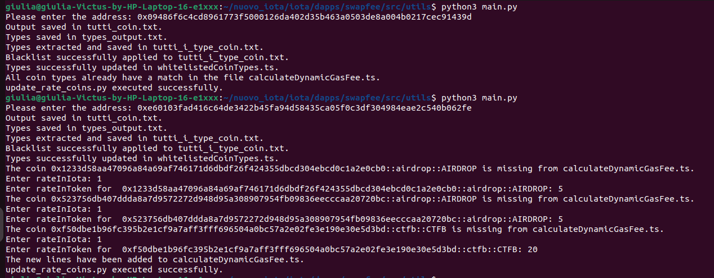

# Dynamic-Gas
## Dynamic Gas Integration for IOTA Move - Future implementations

## Introduction

This folder contains a number of Python scripts that can be used for a possible future implementation of the SwapFee DApp. 
You can view the SwapFee DApp tutorial at this link: [SwapFee DApp Tutorial](https://www.youtube.com/watch?v=yjeIL4L9lGI).

## Script Operation

The main objective of these scripts is to efficiently manage the coins associated with a specific IOTA address. Initially, the script retrieves all the coins held by the given address. Once obtained, a check is made to identify any coins on a ‘black_list’. If found, these coins will be excluded from the final list. All other coins, however, will be used to update the `whiteListedCoinTypes.ts` file.
In addition, the system checks to see if all remaining coins have a stored exchange rate. If one of the coins does not have an exchange rate, the user will be asked to manually provide the missing value. This process ensures that coin management is always accurate and up-to-date.

Below you will find a images highlighting some of the executions/cases: 

## File Structure

The files are divided as follows:

1. **Main.py**: is the main script that asks for the address and runs all the other files.
2. **Fetch_all_coins.py**: fetches the coins held by the address.
3. **Fetch_coin_types.py**: fetches all coin ‘types’.
4. **Extract_types.py**: cleans up the output of the previous script and creates a list of types.
5. **Black_list.py**: checks the list for impermissible types; if so, removes them from the list.
6. **Update_whiteListed.py**: updates the file with the list of coins owned by the address.
7. **Update_rate_coins.py**: checks for the presence of an exchange rate for each stored type; if there are coins without an exchange rate, it asks the user to enter one.

## Instructions for use

1. Make sure you have Python installed on your system;
2. Clone this repository or download the files and place them in the iota/dapps/swapfee/src/utils folder;
3. Open the terminal and run the command `python3 Main.py` to start the process;

Good work!
